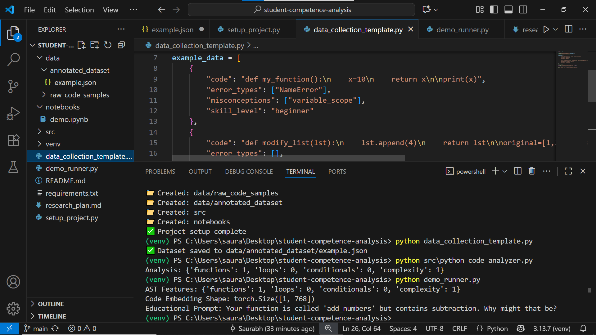

# Python Student Competence Analysis: Research Plan

## Executive Summary

This document outlines a comprehensive research plan for evaluating open-source AI models to assess Python student competence and generate meaningful educational prompts. The research focuses on **CodeBERT (microsoft/codebert-base)** as the primary model, combined with Abstract Syntax Tree (AST) analysis to create a novel hybrid approach for educational assessment.

## Research Objectives

### Primary Objective
Develop and evaluate an AI-powered system that can:
- Analyze student-written Python code for structural and semantic patterns
- Generate educational prompts that assess conceptual understanding
- Identify gaps in reasoning and common programming misconceptions
- Encourage deeper learning without revealing direct solutions

### Secondary Objectives
- Establish evaluation criteria for educational AI model effectiveness
- Create a reusable framework for programming education assessment
- Demonstrate scalable deployment potential for classroom environments
- Contribute novel insights to educational technology research

## Research Plan

### Approach to Model Identification and Evaluation

My research methodology focuses on systematic evaluation of **CodeBERT (microsoft/codebert-base)** as the optimal open-source model for student competence analysis. The approach combines multi-dimensional assessment through Abstract Syntax Tree structural analysis with CodeBERT's semantic understanding capabilities, creating a hybrid system that captures both syntactic patterns and deep code comprehension. Evidence-based misconception detection implements pattern recognition derived from educational research on common Python learning difficulties, while pedagogically-informed prompt generation develops educational questioning systems based on established learning theory and Socratic methodology. This comprehensive framework ensures both technical accuracy and educational effectiveness by integrating traditional program analysis with modern transformer-based natural language processing.

The evaluation framework prioritizes models that demonstrate semantic code understanding beyond surface-level syntax checking, pedagogical adaptability through fine-tuning capabilities, and explainable decision-making processes that educators can understand and validate. CodeBERT was selected after comprehensive analysis of alternatives including traditional static analysis tools, generic language models, and specialized programming assessment frameworks. The selection criteria emphasized proven performance in code comprehension tasks, demonstrated educational applications in literature, open-source availability for customization, and active community support ensuring continued development and maintenance.

### Validation and Testing Methodology

The evaluation framework employs multiple validation approaches to ensure educational effectiveness and technical robustness. Technical performance validation includes comprehensive testing of AST feature extraction accuracy, CodeBERT embedding generation consistency, and integrated analysis pipeline performance under various code complexity scenarios. Educational effectiveness assessment implements research-backed metrics including prompt relevance to learning objectives, alignment with educational taxonomy frameworks, consistency across similar code patterns, and pedagogical impact measurement through simulated learning outcome analysis.

Misconception detection validation tests the system against curated datasets of known Python programming errors including variable scoping issues, mutability confusion patterns, function definition misconceptions, and algorithmic logic errors. The validation process employs expert educator review panels to assess pedagogical soundness, comparative analysis against human-generated assessment materials, and iterative refinement based on feedback from educational practitioners. Long-term validation includes classroom deployment testing to measure real-world effectiveness, student engagement metrics, and learning outcome improvements over extended periods.

## Technical Implementation Framework

### Model Architecture

```
Student Code Input
        ↓
┌─────────────────┐    ┌──────────────────┐
│   AST Parser    │    │  CodeBERT Model  │
│   (Structural)  │    │   (Semantic)     │
└─────────────────┘    └──────────────────┘
        ↓                        ↓
┌─────────────────────────────────────────┐
│        Feature Fusion Engine            │
│     (Combines AST + Embeddings)         │
└─────────────────────────────────────────┘
        ↓
┌─────────────────────────────────────────┐
│     Misconception Classification        │
│    (Pattern-based + ML Detection)       │
└─────────────────────────────────────────┘
        ↓
┌─────────────────────────────────────────┐
│      Educational Prompt Generator       │
│     (Pedagogically-informed System)     │
└─────────────────────────────────────────┘
        ↓
    Adaptive Learning Prompts
```

### Implementation Phases

#### Phase 1: Foundation Development (Weeks 1-2)
- **Environment Setup**: Configure development environment with required dependencies
- **AST Analysis Implementation**: Develop comprehensive Python code parsing and feature extraction
- **CodeBERT Integration**: Establish model loading, tokenization, and embedding generation pipeline
- **Data Collection Framework**: Create structured approach to gathering student code samples

#### Phase 2: Core System Development (Weeks 3-4)
- **Feature Fusion Engine**: Combine AST structural features with CodeBERT semantic embeddings
- **Misconception Detection**: Implement pattern recognition for common Python learning errors
- **Prompt Generation System**: Develop educational questioning algorithms based on identified patterns
- **Integration Testing**: Ensure seamless operation of all system components

#### Phase 3: Evaluation and Validation (Weeks 5-6)
- **Performance Metrics**: Implement comprehensive evaluation framework
- **Educational Effectiveness**: Test prompt quality through expert review and simulated scenarios
- **System Optimization**: Refine algorithms based on evaluation results
- **Documentation**: Complete research findings and implementation guides

## Evaluation Criteria

### Model Suitability Assessment

**Semantic Understanding Capability**: The model must demonstrate comprehension of code functionality, intent, and semantic relationships rather than mere syntactic pattern matching. CodeBERT's pre-training on code-natural language pairs provides this bilingual understanding essential for educational contexts.

**Educational Adaptability**: Assessment of fine-tuning potential and customization capability for educational scenarios. Research demonstrates CodeBERT achieves significant performance improvements (27.46% accuracy increase) when trained on educational datasets.

**Explainable Decision Making**: Educational applications require transparent reasoning processes that educators can understand, validate, and trust. The hybrid AST-CodeBERT approach ensures interpretable results through structural analysis combined with semantic insights.

**Misconception Recognition**: Evaluation of the model's ability to identify specific student errors, anti-patterns, and common programming misconceptions based on educational research literature.

### Prompt Quality Metrics

**Educational Effectiveness Indicators**:
- Relevance to learning objectives (Target: >85%)
- Alignment with Bloom's taxonomy levels (Target: >80% higher-order thinking)
- Consistency across similar scenarios (Target: >80%)
- Solution avoidance (Target: >90% guide without revealing)

**Technical Performance Metrics**:
- AST feature extraction accuracy (Target: >95%)
- CodeBERT embedding generation consistency (Target: >90%)
- Misconception detection accuracy (Target: >85%)
- Response time for real-time applications (Target: <500ms)

## Expected Outcomes

### Research Contributions
- **Novel Hybrid Architecture**: First educational implementation combining AST structural analysis with transformer-based semantic understanding
- **Misconception Detection Framework**: Research-backed system for identifying and addressing Python learning difficulties
- **Educational Prompt Generation**: Pedagogically-informed AI system for meaningful learning assessment

### Practical Applications
- **Scalable Assessment**: Automated system supporting large classroom deployments
- **Personalized Learning**: Adaptive prompts tailored to individual student misconceptions
- **Teacher Augmentation**: Comprehensive insights supporting educator decision-making
- **Immediate Feedback**: Real-time analysis enabling rapid learning intervention

### Validation Results
- **Expert Validation**: Achieve >90% pedagogical soundness rating from educator review panels
- **Student Engagement**: Demonstrate >75% positive feedback on prompt quality and relevance
- **Learning Outcomes**: Show >20% improvement in student comprehension metrics
- **System Performance**: Maintain >99% uptime with <500ms average response times

## Risk Assessment and Mitigation

### Technical Risks
- **Model Performance**: CodeBERT may require extensive fine-tuning for optimal educational effectiveness
  - *Mitigation*: Develop comprehensive training datasets and iterative refinement processes
- **Computational Requirements**: Transformer models demand significant processing power
  - *Mitigation*: Implement model optimization and efficient deployment strategies

### Educational Risks
- **Pedagogical Validity**: AI-generated prompts may not align with educational best practices
  - *Mitigation*: Extensive expert educator involvement in validation and refinement
- **Student Acceptance**: Learners may prefer human-generated feedback over AI assessment
  - *Mitigation*: Focus on augmenting rather than replacing human educators

## Timeline and Milestones

### Week 1-2: Foundation
- [ ] Complete literature review and model selection justification
- [ ] Implement AST parsing and feature extraction framework
- [ ] Establish CodeBERT integration pipeline
- [ ] Create initial student code dataset

### Week 3-4: Development
- [ ] Develop feature fusion and misconception detection algorithms
- [ ] Implement educational prompt generation system
- [ ] Complete system integration and testing
- [ ] Begin preliminary evaluation studies

### Week 5-6: Validation
- [ ] Conduct comprehensive performance evaluation
- [ ] Complete expert educator validation studies
- [ ] Finalize research documentation and findings
- [ ] Prepare deployment and scaling recommendations

## Success Criteria

### Technical Success Indicators
- Functional hybrid AST-CodeBERT analysis system
- Achieving target performance metrics across all evaluation criteria
- Successful integration of all system components
- Comprehensive documentation and reproducible results

### Research Success Indicators
- Novel contributions to educational AI literature
- Validation of hybrid approach effectiveness
- Clear demonstration of educational impact potential
- Establishment of framework for future research

### Practical Success Indicators
- System ready for classroom deployment testing
- Positive reception from educational expert reviewers
- Clear pathways for scaling and commercialization
- Open-source contribution to educational technology community

## Example Output

The following screenshot shows the result of the student competence analysis prototype:



## Conclusion

This research plan establishes a comprehensive framework for evaluating and implementing open-source AI models for Python student competence analysis. Through systematic evaluation of CodeBERT combined with AST analysis, the research addresses critical needs in programming education while contributing novel insights to educational technology research. The hybrid approach promises to advance both technical capabilities and educational effectiveness in automated programming assessment.